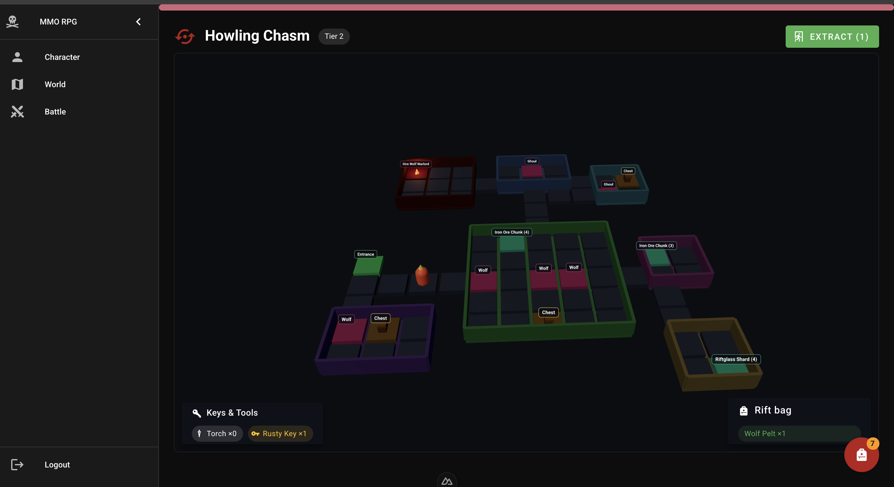

backend
1) Init PRISMA
2) Launch BD
3) Generate seeds

GENERAL
- yarn

PRISMA
- npx prisma generate
- npx prisma migrate dev --name init

SEEDS
- cd backend
- yarn db:seed

BD
- docker compose up -d

### 05.07.2026
How rift looks like

